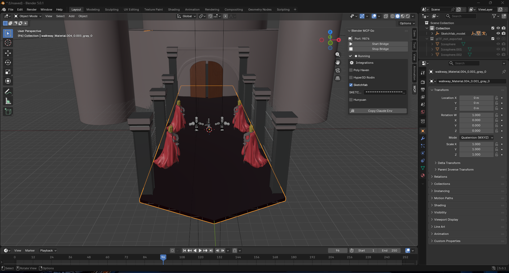

# Blender MCP Go (npm-wrapped)

> Works with any MCP client: **Claude Desktop**, **Amp** (ampcode.com), Cursor, VS Code Copilot, Cline, Continue, etc. Same binary, same JSON-RPC over stdio (`protocolVersion: 2024-11-05`).


[](https://www.npmjs.com/package/@j4flmao/go_blender_mcp)


Lightweight Model Context Protocol server for Blender written in Go, wrapped for npm distribution. One binary, minimal context, optional integrations (Poly Haven, Hyper3D, Sketchfab, Hunyuan) controlled via UI or env flags.

## Overview
- Go MCP server: `blender-mcp-go`
- Blender bridge add-on: simple TCP server that executes commands in Blender
- npm wrapper: cross-platform binaries in `dist/`, launcher at `npm/bin/blender-mcp-go.js`

Inspired by and referencing BlenderMCP (Python) project — see “References”.

## Prerequisites
- Blender ≥ 3.6 (tested on 5.0.1)
- Go ≥ 1.22 (for building binaries)
- Node.js ≥ 18 (for npm wrapper & publishing)

## Quick Setup
1. Build binaries (or use CI artifacts):
   - Windows: `npm run build:win-x64`
   - Linux: `npm run build:linux-x64`
   - macOS ARM: `npm run build:darwin-arm64`
   - All: `npm run build:all`

2. Install Blender bridge add-on:
   - File: [blender_bridge/blender_bridge.py](blender_bridge/blender_bridge.py) or get it from: https://github.com/j4flmao/go_blender_mcp.git
   - Blender → Edit → Preferences → Add-ons → Install → select the file → enable
   - N-panel → MCP → Start Bridge (port 9876)

3. Add MCP server to Claude Desktop (`claude_desktop_config.json`) — Recommended (npx):
```json
{
  "mcpServers": {
    "blender": {
      "command": "npx",
      "args": ["@j4flmao/go_blender_mcp"],
      "env": { }
    }
  }
}
```
Restart Claude Desktop after editing.


### Add to OpenCode
OpenCode uses a different config format with `mcp` as root key and `command` as an array.

Global config location:
- Windows: `%APPDATA%\opencode\opencode.json`
- macOS / Linux: `~/.config/opencode/opencode.json`

Recommended (npx):
```json
{
  "$schema": "https://opencode.ai/config.json",
  "mcp": {
    "blender": {
      "type": "local",
      "command": ["npx", "-y", "@j4flmao/go_blender_mcp"],
      "enabled": true
    }
  }
}
```

Or via project config — create `opencode.json` in your project root:
```json
{
  "$schema": "https://opencode.ai/config.json",
  "mcp": {
    "blender": {
      "type": "local",
      "command": ["npx", "-y", "@j4flmao/go_blender_mcp"],
      "enabled": true
    }
  }
}
```

Notes for OpenCode:
- Config key is `mcp` (not `mcpServers`)
- `command` must be an array: `["npx", "-y", "@j4flmao/go_blender_mcp"]`
- Must include `"type": "local"` for stdio servers
- Restart OpenCode after editing config

### Add to Amp (ampcode.com)
Amp uses the same MCP schema as Claude, just under the `amp.mcpServers` key in `settings.json`.

Settings file location:
- Windows: `%APPDATA%\amp\settings.json`
- macOS / Linux: `~/.config/amp/settings.json`
- VS Code: Settings → Extensions → Amp → MCP Servers (or edit `settings.json` directly)

Recommended (npx):
```json
{
  "amp.mcpServers": {
    "blender": {
      "command": "npx",
      "args": ["-y", "@j4flmao/go_blender_mcp"],
      "env": {}
    }
  }
}
```

Or via CLI (no manual file edit):
```bash
amp mcp add blender -- npx -y @j4flmao/go_blender_mcp
```

One-shot test without persisting config:
```bash
amp --mcp-config "{\"blender\":{\"command\":\"npx\",\"args\":[\"-y\",\"@j4flmao/go_blender_mcp\"]}}" -x "List all objects in the current Blender scene"
```


Notes for Amp:
- Workspace-level configs in `.amp/settings.json` require `amp mcp approve blender` before first run.
- To restrict which tools are exposed (recommended to keep context lean), use `includeTools`:
  ```json
  "blender": {
    "command": "npx",
    "args": ["-y", "@j4flmao/go_blender_mcp"],
    "includeTools": ["get_scene_info", "list_objects", "create_object", "exec_python", "render_scene"]
  }
  ```
- Verify Amp picks it up: `amp mcp doctor` → should list `blender` with the tool count.

4. Optional integrations (UI-driven):
   - In Blender N-panel, open “Integrations”
   - Tick Sketchfab / Hyper3D / Hunyuan / Poly Haven
   - Enter API keys where applicable
   - Tools will respect the current toggles at call time

5. npm usage (as a CLI):
   - Recommended: `npx @j4flmao/go_blender_mcp`
   - Optional: `npm start` (launches platform-specific binary from `npm/dist/`)

## CI/CD
- GitHub Actions workflow builds Windows/Linux/macOS and publishes npm if `NPM_TOKEN` is set
- See [.github/workflows/ci.yml](.github/workflows/ci.yml)

## Tools (high level)
- Core: scene info, list/get/move/create/delete objects, materials, render, set engine, exec Python
- Optional:
  - Poly Haven: HDRI/texture/model import
  - Sketchfab: model search (downloadable/animated/rigged filters)
  - Hyper3D: job submission (Rodin)
  - Hunyuan: placeholder for image→3D

## Result Preview


## References
- BlenderMCP (Python, official repo): https://github.com/ahujasid/blender-mcp

## Notes
- Bridge now executes ops on Blender main thread via a small timer/queue to avoid crashes.
- Tools always list optionals; call-time checks ensure disabled integrations return a clear message.

## Troubleshooting
- Bridge not running: open Blender N-panel → MCP → Start Bridge; ensure port 9876 is free.
- Sketchfab returns non-character results: use filters (`animated=true`, `rigged=true`) or refine query.
- Render slow: lower samples or use EEVEE for previews.
- Binary missing after install: run `npm run build:all` or ensure CI artifacts are available.
- Claude doesn’t see tools: verify config path uses absolute path; restart Claude after changes.

## Contributing
- Fork and create feature branches.
- Keep Go code formatted (`gofmt -w .`) and avoid adding heavy dependencies.
- Prefer concise one-line tool outputs to minimize MCP context.
- Pull Requests should include a short description and, when relevant, screenshots of Blender results.

## License
MIT License. See [LICENSE](LICENSE) for details.

## Acknowledgements
- Thanks to BlenderMCP community and integrations such as Poly Haven, Hyper3D (Rodin), Sketchfab, and Hunyuan.
- Blender trademark is owned by Blender Foundation.
